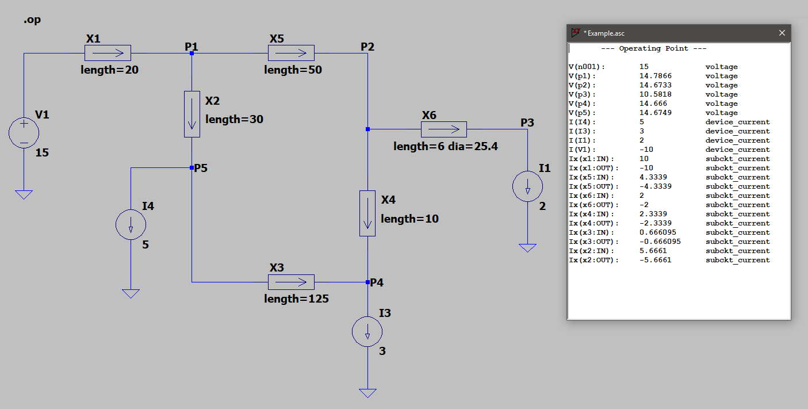
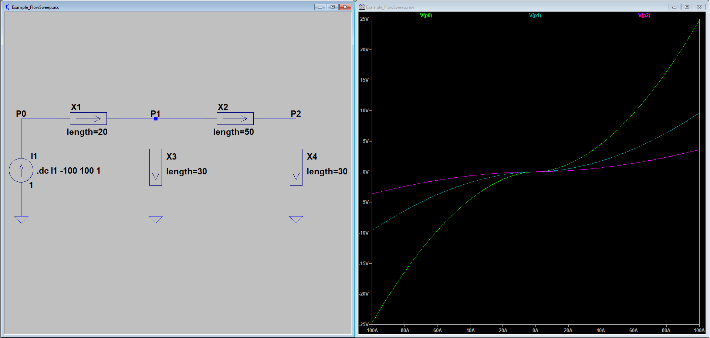

# Pipes

[LT-Spice](https://www.analog.com/en/design-center/design-tools-and-calculators/ltspice-simulator.html) sub-circuit for pipe networks

--------------------------------------------------------------------------------

## Model

The model uses the [Hazen-Williams equation](https://en.wikipedia.org/wiki/Hazen%E2%80%93Williams_equation) to model the flow through a length of pipe, given the head-loss.  Head-loss is represented by a drop in voltage, and flow is represented by the current through the model.

The model properties are:

Property  | Unit              | Default | Parameter
--------  | ----              | ------- | ---------
Head loss | metres of water   | &mdash; | &mdash;
Flow      | litres per second | &mdash; | &mdash;
Length    | metres            | 100 m   | length
Diameter  | millimetres       | 110 mm  | dia
Roughness | &mdash;           | 140     | CH

--------------------------------------------------------------------------------

## Examples

### Static analysis, given input pressure and output flow rates:

--------------------------------------------------------------------------------

### System pressures, as a function of input flow rate:

--------------------------------------------------------------------------------

## External Links

- [Hierarchical Blocks in LT-Spice](http://www.audio-perfection.com/spice-ltspice/hierarchical-blocks-in-ltspice.html)
- [Passing Parameters to Hierarchical Block](http://www.audio-perfection.com/spice-ltspice/passing-parameters-to-hierarchical-block.html)

