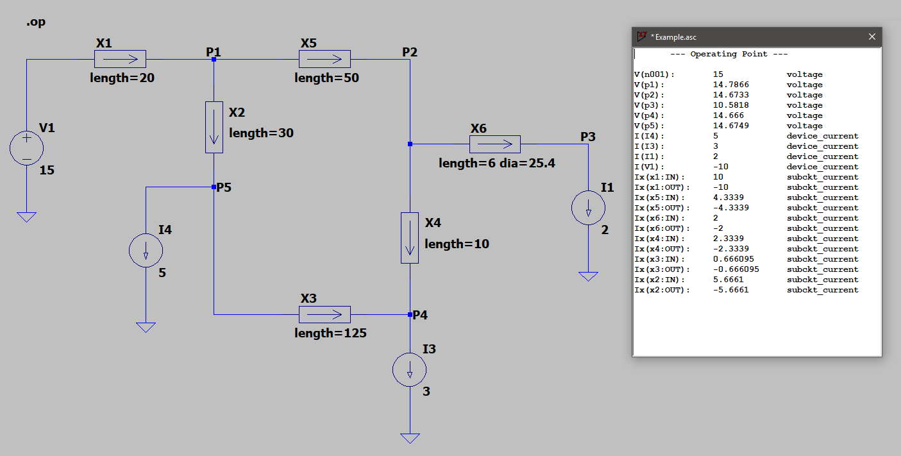

# Pipes

[LT-Spice](https://www.analog.com/en/design-center/design-tools-and-calculators/ltspice-simulator.html) Sub-circuit for Pipe Networks

## Model

The model uses the [Hazen-Williams equation](https://en.wikipedia.org/wiki/Hazen%E2%80%93Williams_equation) to model the flow through a length of pipe, given the head-loss.  Head-loss is represented by a drop in voltage, and flow is represented by the current through the model.

The natural units of the model are:

Property  | Unit
--------  | ----
Head loss | metres of water
Flow      | litres per second
Length    | metres
Diameter  | millimetres

## Example

## External Links

- [Hierarchical Blocks in LT-Spice](http://www.audio-perfection.com/spice-ltspice/hierarchical-blocks-in-ltspice.html)
- [Passing Parameters to Hierarchical Block](http://www.audio-perfection.com/spice-ltspice/passing-parameters-to-hierarchical-block.html)

